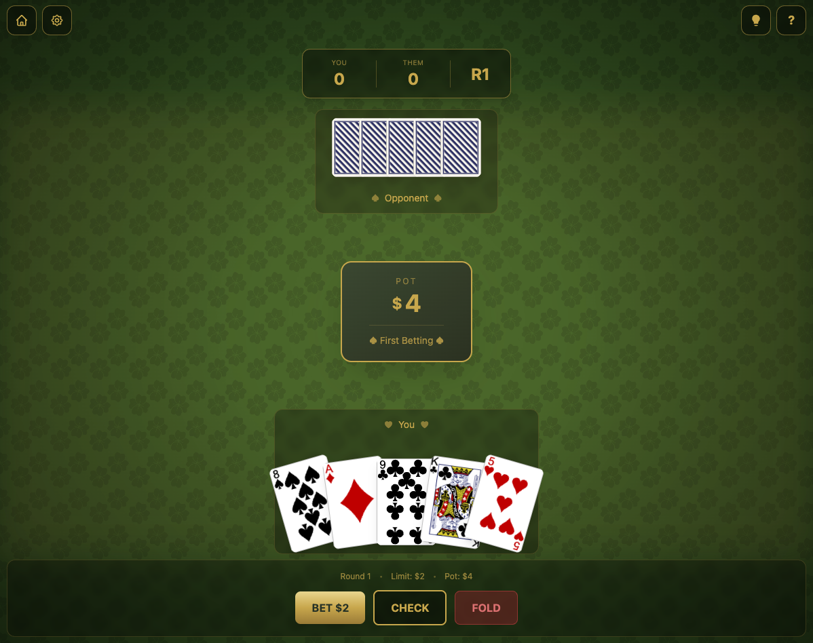
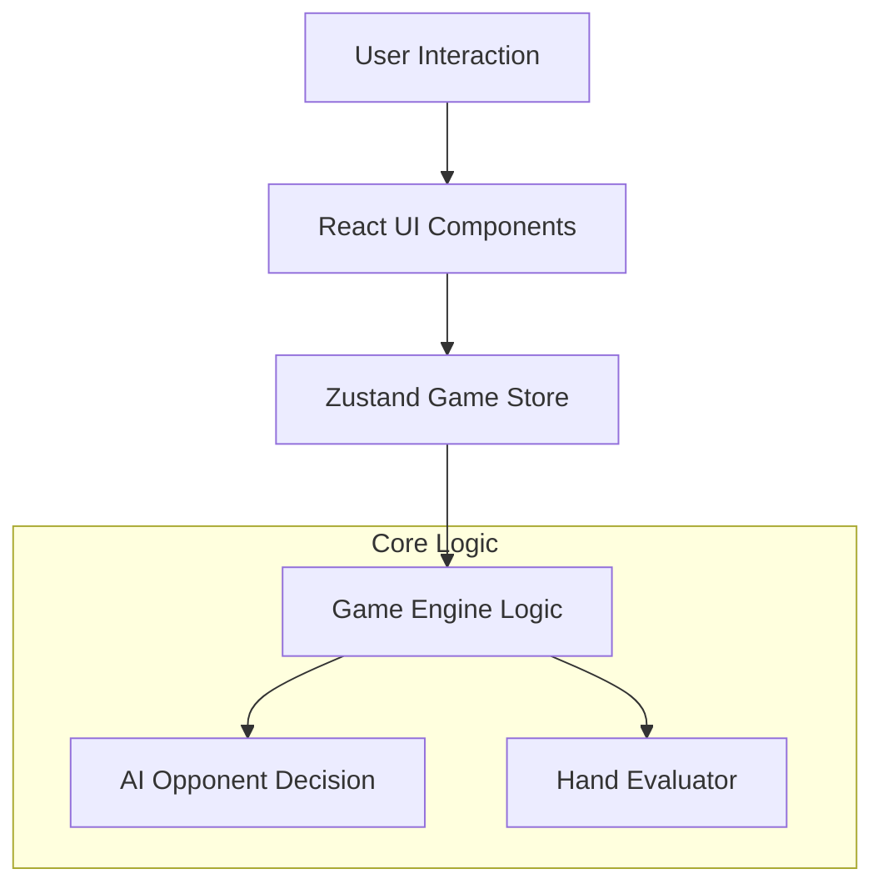

# 🃏 5-Card Draw Poker


> A modern, interactive, and strategic 5-Card Draw Poker game built with Next.js, featuring a smart AI opponent, 3D card visualizations, and a robust state management system.

---

## 📖 Table of Contents

-   [Features](#-features)
-   [Screenshots](#-screenshots)
-   [Architecture](#-architecture)
-   [Installation](#-installation)
-   [Game Rules](#-game-rules)
-   [Documentation](#-documentation)
-   [Contributing](#-contributing)
-   [License](#-license)

---

## ✨ Features

*   **Smart AI Opponent**: An adaptive AI that calculates pot odds, hand strength, and bluffs intelligently.
*   **Immersive UI**: Beautiful 3D card animations using React Three Fiber and Framer Motion.
*   **Robust Game Engine**: A strictly typed, rule-enforcing poker engine handling all game phases.
*   **State Persistence**: Game progress is automatically saved, allowing you to resume matches later.
*   **Responsive Design**: Fully responsive interface optimized for both desktop and tablet experiences.
*   **Sound & Settings**: Customizable game settings including animation speed and sound toggles.

---

## 📸 Screenshots

### Home Screen


### Game Screen


---

## 🏗 Architecture

The project follows a clean, modular architecture separating the UI, State, and Logic layers.



See [ARCHITECTURE.md](docs/ARCHITECTURE.md) for a deep dive into the system design.

---

## 🚀 Installation

1.  **Clone the repository**:
    ```bash
    git clone https://github.com/yourusername/poker-game.git
    cd poker-game
    ```

2.  **Install dependencies**:
    ```bash
    npm install
    ```

3.  **Run the development server**:
    ```bash
    npm run dev
    ```

4.  **Open the application**:
    Navigate to [http://localhost:3000](http://localhost:3000) to start playing!

---

## 🎮 Game Rules

This game implements **Fixed-Limit 5-Card Draw**.

1.  **Deal**: 5 cards to each player.
2.  **Betting Round 1**: Small bet limit ($2).
3.  **Draw**: Discard and replace up to 3 cards.
4.  **Betting Round 2**: Big bet limit ($4).
5.  **Showdown**: Best hand wins the pot.

**Winning**: The first player to reach a total score of **100** wins the match.

See [GAME_RULES.md](docs/GAME_RULES.md) for detailed rules and hand rankings.

---

## 📚 Documentation

We provide world-class documentation to help you understand and contribute to the project:

*   **[Architecture Guide](docs/ARCHITECTURE.md)**: System design, state machines, and data flow.
*   **[AI Logic](docs/AI_LOGIC.md)**: How the AI opponent thinks and decides.
*   **[Game Rules](docs/GAME_RULES.md)**: Complete ruleset and mechanics.
*   **[Contributing](docs/CONTRIBUTING.md)**: Guidelines for code style and PRs.

---

## 🤝 Contributing

Contributions are welcome! Please read our [Contributing Guide](docs/CONTRIBUTING.md) before submitting a Pull Request.

1.  Fork the Project
2.  Create your Feature Branch (`git checkout -b feature/AmazingFeature`)
3.  Commit your Changes (`git commit -m 'Add some AmazingFeature'`)
4.  Push to the Branch (`git push origin feature/AmazingFeature`)
5.  Open a Pull Request

---

## 📄 License

Distributed under the MIT License. See `LICENSE` for more information.

