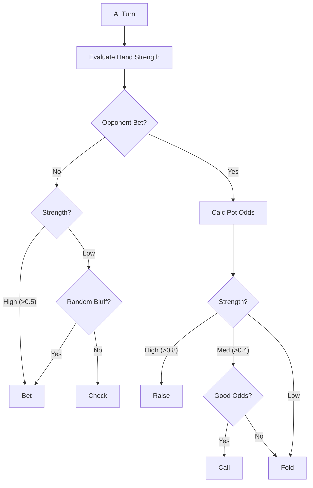

# AI Logic

The AI opponent is designed to play a strategic game of Fixed-Limit 5-Card Draw Poker. It evaluates its hand, calculates pot odds, and makes decisions based on a probabilistic model.

## Decision Making Process

The AI decision logic is encapsulated in the `makeAIDecision` function (`src/lib/poker/aiOpponent.ts`).

### 1. Hand Evaluation

The AI evaluates its hand strength on a scale of 0.0 to 1.0.

*   **Full Evaluation**: If all cards are known (e.g., after the draw), it calculates the exact hand rank.
*   **Strength Normalization**:
    *   `ROYAL_FLUSH`: 1.0
    *   `STRAIGHT_FLUSH`: 0.98
    *   `FOUR_OF_A_KIND`: 0.95
    *   `FULL_HOUSE`: 0.85
    *   `FLUSH`: 0.75
    *   `STRAIGHT`: 0.7
    *   `THREE_OF_A_KIND`: 0.6
    *   `TWO_PAIR`: 0.5
    *   `PAIR`: 0.3
    *   `HIGH_CARD`: 0.1

### 2. Pot Odds Calculation

The AI calculates the **Pot Odds** to determine if a call is profitable.

$$ \text{Pot Odds} = \frac{\text{Current Pot Size} + \text{Amount to Call}}{\text{Amount to Call}} $$

If the probability of winning (estimated from hand strength) is greater than the inverse of the pot odds, the AI is inclined to Call or Raise.

### 3. Action Selection Logic

The decision tree handles different scenarios:

#### Strong Hand (> 0.8)
*   **Aggressive**: Bets or Raises max limit to build the pot.
*   **Value Betting**: Calls if the player raises, trapping them.

#### Medium Hand (0.4 - 0.6)
*   **Cautious**: Calls if pot odds are favorable (> 4:1).
*   **Fold**: Folds if the bet is too high relative to the pot.

#### Weak Hand (< 0.4)
*   **Bluffing**: Small chance (30%) to check/bet on opening to simulate strength.
*   **Fold**: Generally folds to any significant aggression.

### 4. Drawing Strategy

During the Draw phase, the AI:
1.  **Keeps Made Hands**: If it has a Straight, Flush, or Full House, it stands pat.
2.  **Keeps Pairs/Trips**: Discards kickers to try and improve to Three of a Kind or Quads.
3.  **Discards**: Removes cards that don't contribute to the primary potential hand combination.

## Flowchart

