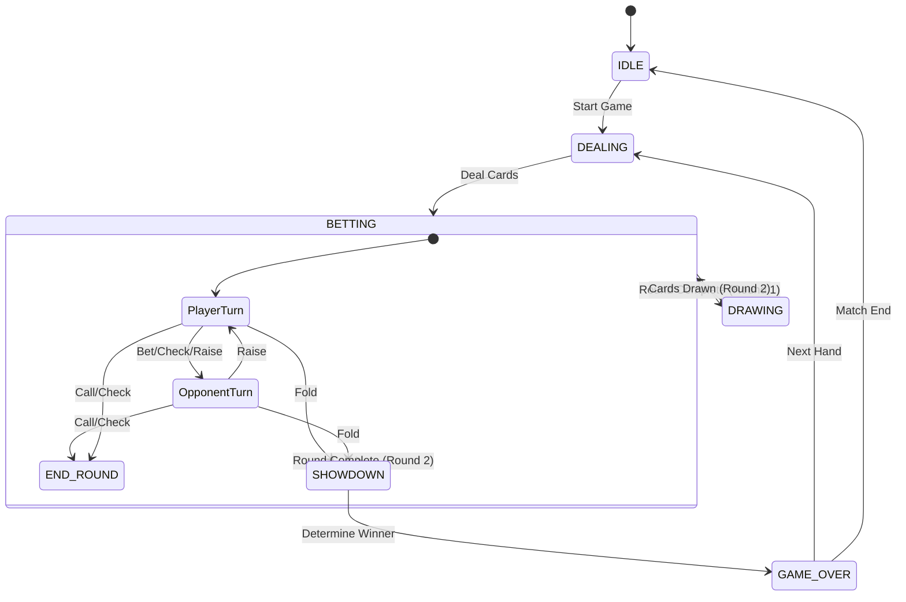

# System Architecture

This document describes the high-level architecture of the Poker Game application.

## Overview

The application is built using **Next.js** for the frontend framework, utilizing **React** for UI components and **Zustand** for state management. The game logic is decoupled from the UI, residing in core libraries that handle rules, hand evaluation, and AI decision-making.

## Tech Stack

-   **Frontend**: Next.js 14 (App Router), React 18
-   **Styling**: Tailwind CSS
-   **State Management**: Zustand (with persistence)
-   **Graphics**: React Three Fiber / Three.js (for 3D card elements), SVG (for 2D)
-   **Animation**: Framer Motion

## Core Components

The system is divided into three main layers:

1.  **UI Layer**: React components located in `src/components`.
2.  **State Layer**: Global game store managed by Zustand in `src/store`.
3.  **Logic Layer**: Pure functions and classes handling game rules in `src/lib`.

### Component Diagram

```mermaid
graph TD
    User[User] --> UI[UI Components]
    UI --> Store[Game Store (Zustand)]
    Store --> Logic[Game Logic Library]
    Logic --> Deck[Deck Management]
    Logic --> Evaluator[Hand Evaluator]
    Logic --> AI[AI Opponent]
    
    subgraph "UI Components"
        GameBoard
        PlayerHand
        OpponentHand
        GameControls
        ScoreDisplay
    end
    
    subgraph "Game Logic"
        GameEngine
        HandEvaluator
        AIOpponent
    end
```

## State Management

The `GameStore` (`src/store/gameStore.ts`) is the single source of truth for the application state. It manages:

*   **Game Phases**: `IDLE`, `DEALING`, `BETTING`, `DRAWING`, `SHOWDOWN`, `GAME_OVER`.
*   **Player States**: Chips, hand cards, active status.
*   **Betting**: Pot size, current bet, betting round status.
*   **Match Progress**: Score tracking (first to 100).

### Game State Machine



## Data Flow

1.  **User Action**: User clicks a button (e.g., "Bet").
2.  **Store Action**: The component calls a store action (`playerBet`).
3.  **State Update**: The store updates the state (chips, pot, current bet).
4.  **Side Effects**:
    *   If the player action ends their turn, the store triggers `opponentAction`.
    *   The `opponentAction` calls `makeAIDecision` from the Logic Layer.
    *   The store updates based on the AI's decision.
5.  **Re-render**: Components subscribed to the changed state re-render.

## File Structure

```
src/
├── app/                 # Next.js App Router pages
├── components/          # React components
│   ├── game/            # Game-specific components
│   ├── layout/          # Layout components
│   └── ui/              # Reusable UI components
├── hooks/               # Custom React hooks
├── lib/                 # Core business logic
│   ├── poker/           # Poker specific logic (AI, Rules, Deck)
│   └── utils/           # General utilities
├── store/               # Zustand state stores
└── types/               # TypeScript type definitions
```

