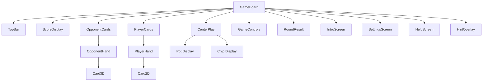
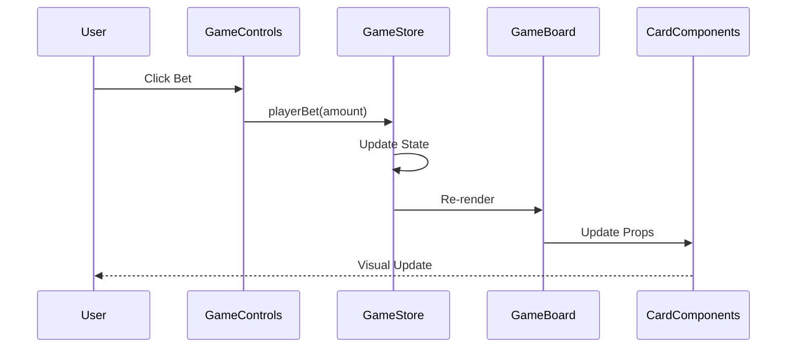

# Component Documentation

Complete documentation for all React components in the poker game.

## Component Overview



## Core Components

### GameBoard

**Location**: `src/components/game/GameBoard.tsx`

Main container component that orchestrates the entire game interface.

**Props**: None (uses Zustand store)

**Responsibilities**:
- Layout management
- Overlay state management (settings, help, hints)
- Phase-based rendering
- Background and visual effects

**Key Features**:
- Conditional rendering based on `showIntro` state
- Animated overlays using Framer Motion
- Responsive layout with Tailwind CSS
- Background image with overlay effects

**State Dependencies**:
- `showIntro`: Controls intro screen visibility
- `phase`: Current game phase
- `player`, `opponent`: Player states
- `matchPlayerScore`, `matchOpponentScore`: Match scores

### TopBar

**Location**: `src/components/game/TopBar.tsx`

Navigation bar with action buttons.

**Props**:
```typescript
interface TopBarProps {
  onHome: () => void;
  onSettings: () => void;
  onHint: () => void;
  onHelp: () => void;
}
```

**Features**:
- Home button (returns to intro)
- Settings button
- Hint button
- Help button

### ScoreDisplay

**Location**: `src/components/game/ScoreDisplay.tsx`

Displays match scores for both players.

**Props**: None (reads from store)

**Displays**:
- Player score
- Opponent score
- Target score (100)
- Progress indicators

### OpponentCards

**Location**: `src/components/game/OpponentCards.tsx`

Container for opponent's card display.

**Props**: None (reads from store)

**Features**:
- Renders `OpponentHand` component
- Shows opponent name
- Displays fold status

### PlayerCards

**Location**: `src/components/game/PlayerCards.tsx`

Container for player's card display.

**Props**: None (reads from store)

**Features**:
- Renders `PlayerHand` component
- Shows player name
- Displays fold status

### CenterPlay

**Location**: `src/components/game/CenterPlay.tsx`

Central play area showing pot and community information.

**Props**: None (reads from store)

**Displays**:
- Current pot size
- Betting round information
- Chip animations

### GameControls

**Location**: `src/components/game/GameControls.tsx`

Control panel for player actions.

**Props**: None (uses store actions)

**Actions**:
- Bet button
- Check button
- Call button
- Raise button
- Fold button

**Features**:
- Disabled states based on game phase
- Bet amount input for bet/raise
- Visual feedback for available actions

### RoundResult

**Location**: `src/components/game/RoundResult.tsx`

Modal displaying hand results and match status.

**Props**:
```typescript
interface RoundResultProps {
  winner: 'player' | 'opponent' | 'tie' | null;
  matchWinner: 'player' | 'opponent' | null;
  message: string;
  playerScore: number;
  opponentScore: number;
  onContinue: () => void;
}
```

**Features**:
- Winner announcement
- Match winner celebration
- Score display
- Continue button

## Card Components

### Card2D

**Location**: `src/components/game/Card2D.tsx`

2D card component for player's hand.

**Props**:
```typescript
interface Card2DProps {
  card: Card;
  isSelected?: boolean;
  isFaceUp?: boolean;
  onClick?: () => void;
  index?: number;
}
```

**Features**:
- SVG card rendering
- Selection highlighting
- Click handling
- Face up/down states
- Hover effects

### Card3D

**Location**: `src/components/game/Card3D.tsx`

3D card component using Three.js for opponent's hand.

**Props**:
```typescript
interface Card3DProps {
  card: Card;
  position: [number, number, number];
  isFaceUp?: boolean;
  rotation?: [number, number, number];
}
```

**Features**:
- Three.js 3D rendering
- Isometric camera view
- Card back texture
- Smooth animations

### PlayerHand

**Location**: `src/components/game/PlayerHand.tsx`

Container for player's 5 cards.

**Props**: None (reads from store)

**Features**:
- Renders 5 `Card2D` components
- Handles card selection
- Displays selected state
- Card spacing and layout

### OpponentHand

**Location**: `src/components/game/OpponentHand.tsx`

Container for opponent's 5 cards in 3D.

**Props**: None (reads from store)

**Features**:
- Renders 5 `Card3D` components
- 3D positioning and rotation
- Face down cards (hidden)
- Reveal animations

## Screen Components

### IntroScreen

**Location**: `src/components/game/IntroScreen.tsx`

Welcome screen with game options.

**Props**:
```typescript
interface IntroScreenProps {
  onNewGame: () => void;
  onContinueGame: () => void;
  canContinue: boolean;
  playerScore: number;
  opponentScore: number;
  settings: Settings;
  gameHistory: GameHistory[];
  onUpdateSettings: (settings: Settings) => void;
  onResetMatch: () => void;
}
```

**Features**:
- New game button
- Continue game button
- Score display
- Game history
- Settings access
- Reset match option

### SettingsScreen

**Location**: `src/components/game/SettingsScreen.tsx`

Settings configuration modal.

**Props**:
```typescript
interface SettingsScreenProps {
  onClose: () => void;
  settings: Settings;
  onSave: (settings: Settings) => void;
  onResetMatch: () => void;
}
```

**Settings**:
- Sound enabled/disabled
- Music enabled/disabled
- Animation speed (slow/normal/fast)

### HelpScreen

**Location**: `src/components/game/HelpScreen.tsx`

Help and rules documentation modal.

**Props**:
```typescript
interface HelpScreenProps {
  onClose: () => void;
}
```

**Content**:
- Game rules
- Hand rankings
- Betting rules
- Strategy tips

### TutorialScreen

**Location**: `src/components/game/TutorialScreen.tsx`

Interactive tutorial guide.

**Props**:
```typescript
interface TutorialScreenProps {
  onClose: () => void;
  onSkip: () => void;
}
```

**Features**:
- Step-by-step tutorial
- Interactive examples
- Skip option

### GameHistoryScreen

**Location**: `src/components/game/GameHistoryScreen.tsx`

Displays game history and statistics.

**Props**:
```typescript
interface GameHistoryScreenProps {
  history: GameHistory[];
  onClose: () => void;
}
```

**Displays**:
- Win/loss record
- Score history
- Date stamps
- Statistics

## UI Components

### Button

**Location**: `src/components/ui/Button.tsx`

Reusable button component.

**Props**:
```typescript
interface ButtonProps {
  children: React.ReactNode;
  onClick?: () => void;
  disabled?: boolean;
  variant?: 'primary' | 'secondary' | 'danger';
  size?: 'sm' | 'md' | 'lg';
  className?: string;
}
```

**Variants**:
- `primary`: Main action button
- `secondary`: Secondary action
- `danger`: Destructive action (fold)

### Chip

**Location**: `src/components/ui/Chip.tsx`

Poker chip component for visual display.

**Props**:
```typescript
interface ChipProps {
  value: number;
  size?: 'sm' | 'md' | 'lg';
  color?: string;
}
```

**Features**:
- Value display
- Size variants
- Color customization
- Stacking visualization

### Modal

**Location**: `src/components/ui/Modal.tsx`

Reusable modal component.

**Props**:
```typescript
interface ModalProps {
  isOpen: boolean;
  onClose: () => void;
  title?: string;
  children: React.ReactNode;
  size?: 'sm' | 'md' | 'lg' | 'xl';
}
```

**Features**:
- Backdrop overlay
- Close button
- Size variants
- Animation support

## Layout Components

### Breadcrumbs

**Location**: `src/components/layout/Breadcrumbs.tsx`

Navigation breadcrumb component.

**Props**:
```typescript
interface BreadcrumbsProps {
  items: Array<{
    label: string;
    href?: string;
  }>;
}
```

**Features**:
- Hierarchical navigation
- Link support
- Current page highlighting

## Hooks

### useCardAnimation

**Location**: `src/hooks/useCardAnimation.ts`

Custom hook for card animation logic.

**Returns**:
```typescript
{
  animateCard: (cardIndex: number) => void;
  isAnimating: boolean;
}
```

**Features**:
- Card flip animations
- Deal animations
- Draw animations

### useIsometricCamera

**Location**: `src/hooks/useIsometricCamera.ts`

Custom hook for Three.js isometric camera setup.

**Returns**:
```typescript
{
  camera: THREE.PerspectiveCamera;
  updateCamera: (position: [number, number, number]) => void;
}
```

**Features**:
- Camera positioning
- Isometric angle calculation
- Smooth camera transitions

## Component Communication



## Styling

All components use Tailwind CSS for styling:

- **Responsive**: Mobile-first design
- **Theming**: Consistent color scheme
- **Animations**: Framer Motion for transitions
- **3D**: Three.js for 3D components

## Best Practices

1. **Component Composition**: Break down into smaller, reusable components
2. **Props Validation**: Use TypeScript interfaces for prop types
3. **State Management**: Use Zustand store for global state
4. **Performance**: Memoize expensive components
5. **Accessibility**: Include ARIA labels and keyboard support

