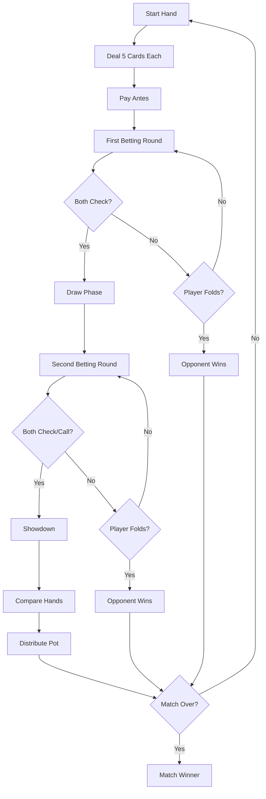

# Game Rules

Complete rules and mechanics for the 5-Card Draw Poker game.

## Overview

5-Card Draw is a classic poker variant where each player receives 5 cards, has the opportunity to discard and draw new cards, and then competes in a final betting round. The player with the best hand wins the pot.

## Game Structure

### Match Format

- **Objective**: First player to reach 100 points wins the match
- **Scoring**: Points equal the pot size won in each hand
- **Match Continuity**: Scores persist across hands until match completion

### Hand Structure

Each hand consists of the following phases:

1. **Deal Phase**
2. **First Betting Round**
3. **Draw Phase**
4. **Second Betting Round**
5. **Showdown**

## Detailed Phase Rules

### 1. Deal Phase

- Each player receives **5 cards face down**
- Both players pay an **ante** ($2 each)
- Ante goes into the pot ($4 total)
- First betting round begins with the player acting first

### 2. First Betting Round

**Betting Limits:**
- **Small Bet**: $2 maximum
- Players can bet, check, call, raise, or fold

**Action Sequence:**
1. Player acts first
2. Opponent responds
3. Betting continues until both players have matched bets or one folds

**Valid Actions:**
- **Bet**: Place a bet (up to $2)
- **Check**: Pass when no bet exists
- **Call**: Match the current bet
- **Raise**: Increase the bet (up to $2 total)
- **Fold**: Surrender the hand

**Betting Round Ends When:**
- Both players check (no bets)
- Both players call (matched bets)
- One player folds

### 3. Draw Phase

**Player Actions:**
- Select cards to discard (0-5 cards)
- Click "Draw" to receive new cards
- Opponent draws automatically based on AI logic

**Rules:**
- Can discard any number of cards (0-5)
- Discarded cards are replaced from the deck
- Both players draw before second betting round

### 4. Second Betting Round

**Betting Limits:**
- **Big Bet**: $4 maximum
- Same action sequence as first round
- Higher stakes create more strategic decisions

**Showdown Trigger:**
- If both players check or call, proceed to showdown
- If one folds, the other wins immediately

### 5. Showdown

**Reveal:**
- All cards are revealed face up
- Hands are evaluated and compared

**Winning:**
- Best hand wins the entire pot
- In case of tie, pot is split evenly
- Winner receives pot as points toward match total

## Hand Rankings

Hands are ranked from highest to lowest:

### 1. Royal Flush
- A, K, Q, J, 10 of the same suit
- **Example**: A♠ K♠ Q♠ J♠ 10♠

### 2. Straight Flush
- Five consecutive cards of the same suit
- **Example**: 9♥ 8♥ 7♥ 6♥ 5♥
- **Note**: A-2-3-4-5 (wheel) is the lowest straight flush

### 3. Four of a Kind
- Four cards of the same rank
- **Example**: K♠ K♥ K♦ K♣ 7♠

### 4. Full House
- Three of a kind + pair
- **Example**: Q♠ Q♥ Q♦ 9♣ 9♥

### 5. Flush
- Five cards of the same suit (not consecutive)
- **Example**: A♣ 10♣ 7♣ 5♣ 3♣

### 6. Straight
- Five consecutive cards (different suits)
- **Example**: 10♠ 9♥ 8♦ 7♣ 6♠
- **Note**: A-2-3-4-5 (wheel) is the lowest straight

### 7. Three of a Kind
- Three cards of the same rank
- **Example**: 8♠ 8♥ 8♦ K♣ 2♠

### 8. Two Pair
- Two pairs of different ranks
- **Example**: J♠ J♥ 7♦ 7♣ A♠

### 9. Pair
- Two cards of the same rank
- **Example**: 5♠ 5♥ K♦ Q♣ 9♠

### 10. High Card
- No pair or better
- **Example**: A♠ K♦ 10♣ 7♥ 3♠

## Tie-Breaking Rules

When hands have the same rank, kickers determine the winner:

### Four of a Kind
- Higher four of a kind wins
- If same, higher kicker wins

### Full House
- Higher three of a kind wins
- If same, higher pair wins

### Flush
- Compare highest card, then second highest, etc.

### Straight
- Higher top card wins
- A-2-3-4-5 loses to 2-3-4-5-6

### Three of a Kind
- Higher three of a kind wins
- If same, compare kickers (highest first)

### Two Pair
- Higher pair wins
- If same, compare second pair
- If same, compare kicker

### Pair
- Higher pair wins
- If same, compare kickers (highest to lowest)

### High Card
- Compare cards from highest to lowest

## Betting Rules

### Fixed-Limit Structure

- **Small Bet**: $2 (first betting round)
- **Big Bet**: $4 (second betting round)
- **Ante**: $2 per player (before each hand)

### Betting Actions

**Bet:**
- Place chips into the pot
- Must be within betting limit
- Cannot bet more chips than you have

**Check:**
- Pass action without betting
- Only valid when no bet exists
- If both players check, proceed to next phase

**Call:**
- Match the current bet
- Required to stay in the hand
- Must have sufficient chips

**Raise:**
- Increase the bet amount
- Must be within betting limit
- Opponent can call, re-raise, or fold

**Fold:**
- Surrender the hand
- Lose all chips already in pot
- Opponent wins immediately

### All-In Rules

- If a player doesn't have enough chips to call, they go "all-in"
- Opponent can only win up to the all-in amount
- Side pot rules apply (not implemented in current version)

## AI Opponent Behavior

The AI opponent makes decisions based on:

1. **Hand Strength** (0.0 - 1.0)
   - Evaluates current hand quality
   - Considers visible cards and potential improvements

2. **Pot Odds**
   - Calculates ratio of pot size to call amount
   - Calls when pot odds are favorable

3. **Betting Round**
   - More conservative in first round
   - More aggressive in second round with strong hands

4. **Bluffing**
   - Occasionally checks with weak hands
   - Rarely bluffs aggressively

### AI Decision Thresholds

- **Hand Strength ≥ 0.8**: Aggressive betting/raising
- **Hand Strength ≥ 0.6**: Moderate betting, calls with good pot odds (>3:1)
- **Hand Strength ≥ 0.4**: Calls only with very favorable pot odds (>4:1)
- **Hand Strength < 0.4**: Folds unless pot odds are exceptional (>8:1)

## Scoring System

### Match Scoring

- **Target**: 100 points
- **Points**: Equal to pot size won
- **Match Winner**: First to reach 100 points

### Example Scoring

- Hand 1: Player wins $10 pot → Player: 10, Opponent: 0
- Hand 2: Opponent wins $8 pot → Player: 10, Opponent: 8
- Hand 3: Player wins $12 pot → Player: 22, Opponent: 8
- Continues until one player reaches 100

## Strategy Tips

### First Betting Round

- **Strong Hands**: Bet to build the pot
- **Medium Hands**: Check to see a draw cheaply
- **Weak Hands**: Fold if facing a bet

### Draw Phase

- **Keep Pairs**: Discard the other three cards
- **Keep High Cards**: Discard low cards
- **Drawing to Straights/Flushes**: Keep connected cards or suited cards

### Second Betting Round

- **Strong Hands**: Bet aggressively (big bet limit)
- **Medium Hands**: Call if pot odds are good
- **Weak Hands**: Fold unless pot is very large

### General Tips

- Pay attention to opponent betting patterns
- Consider pot odds before calling
- Don't chase weak draws
- Manage your chip stack carefully

## Common Scenarios

### Scenario 1: Both Players Check

- First round: Proceed to draw phase
- Second round: Proceed to showdown

### Scenario 2: Player Folds

- Opponent wins pot immediately
- No showdown required
- Points awarded to winner

### Scenario 3: Tie Hand

- Pot is split evenly
- Both players receive equal points
- Match continues

### Scenario 4: Insufficient Chips

- Player goes all-in
- Opponent can only win up to all-in amount
- Remaining chips form side pot (not implemented)

## Game Flow Diagram

